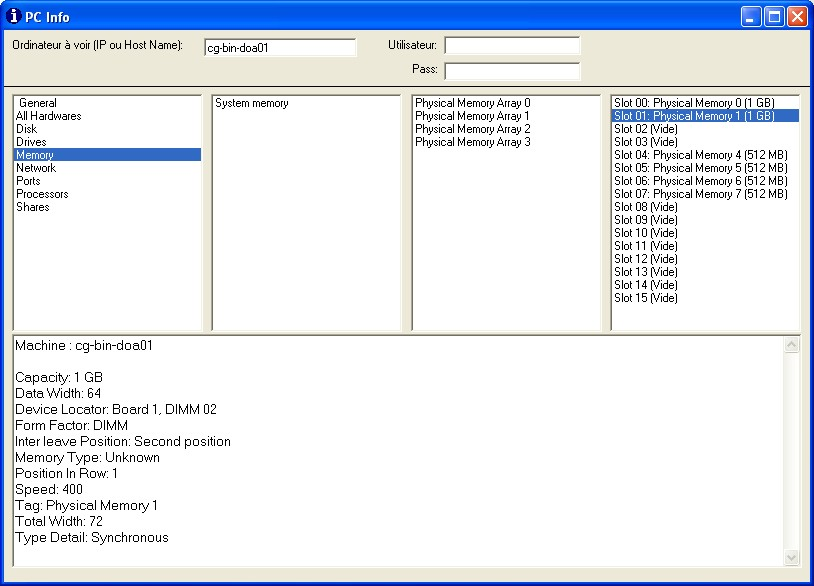



## PC Info

### Description

PC Info, to get the hardware informations (HDD, Processors... and specially Memory modules) using WMI.(OS Systems: NT4 with WMI, 2K, XP)
 
### More Info
 

             |
---                |---
**Submitted On**   |2006-09-02 12:13:14
**By**             |[Pierre AOUN](https://github.com/Planet-Source-Code/PSCIndex/blob/master/ByAuthor/pierre-aoun.md)
**Level**          |Intermediate
**User Rating**    |5.0 (45 globes from 9 users)
**Compatibility**  |VB 6\.0
**Category**       |[Windows System Services](https://github.com/Planet-Source-Code/PSCIndex/blob/master/ByCategory/windows-system-services__1-35.md)
**World**          |[Visual Basic](https://github.com/Planet-Source-Code/PSCIndex/blob/master/ByWorld/visual-basic.md)
**Archive File**   |[PC\_Info2019129102006\.zip](https://github.com/Planet-Source-Code/pierre-aoun-pc-info__1-66523/archive/master.zip)

